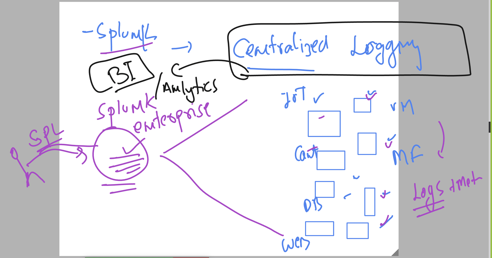
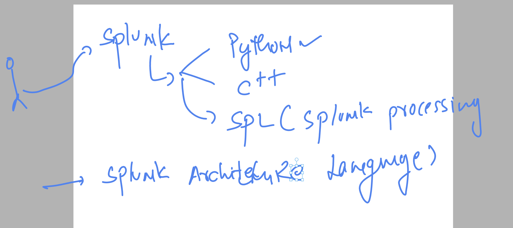
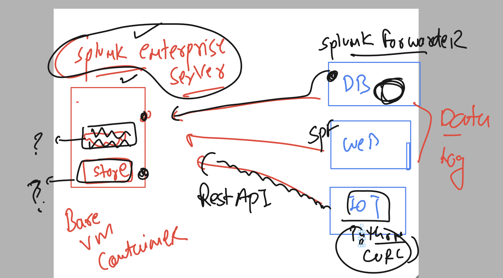
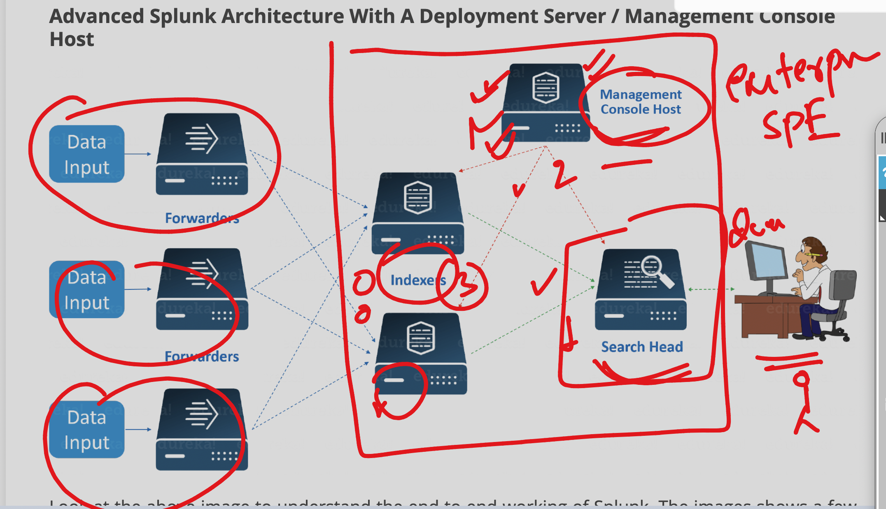
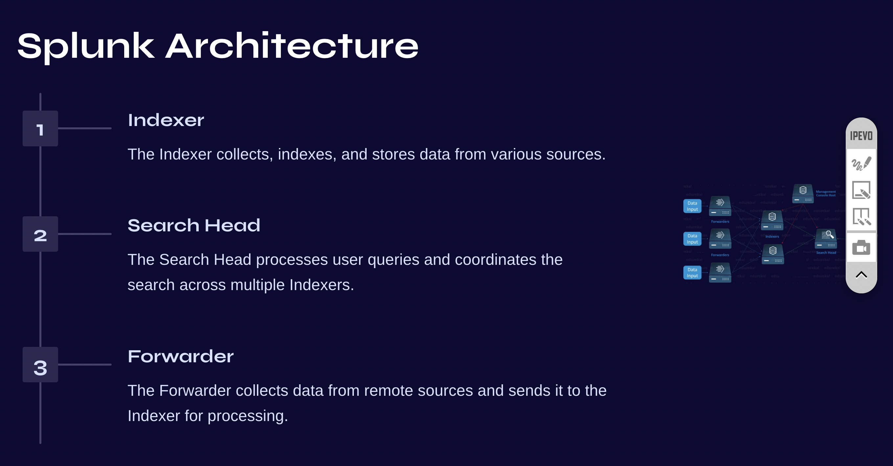
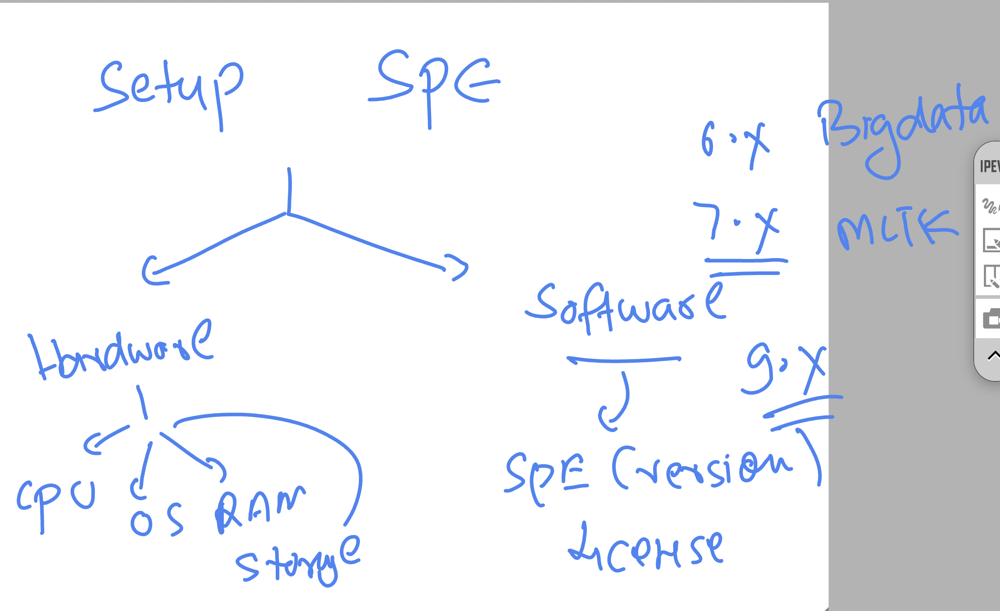
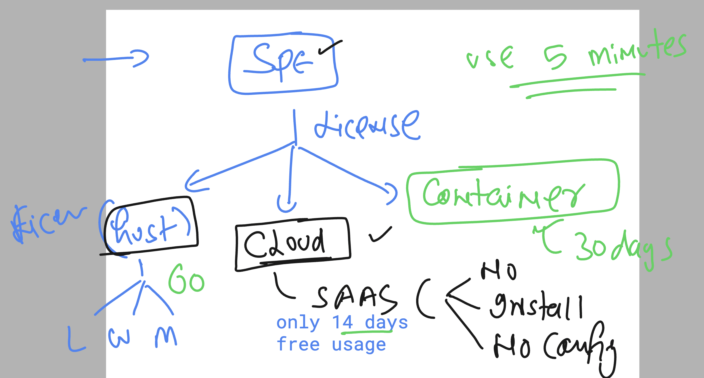
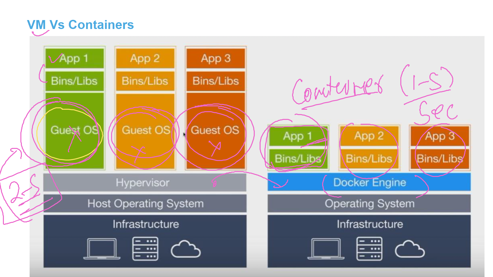
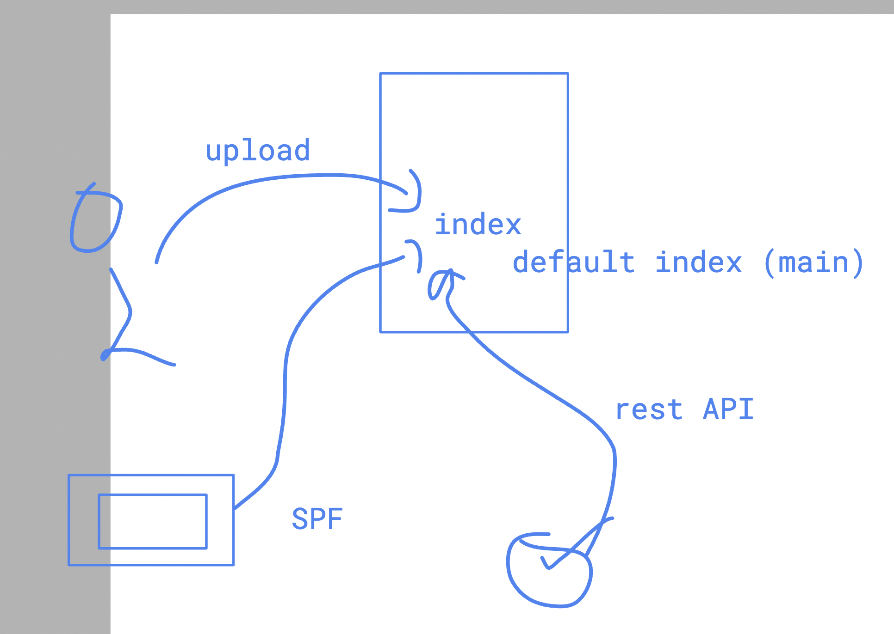
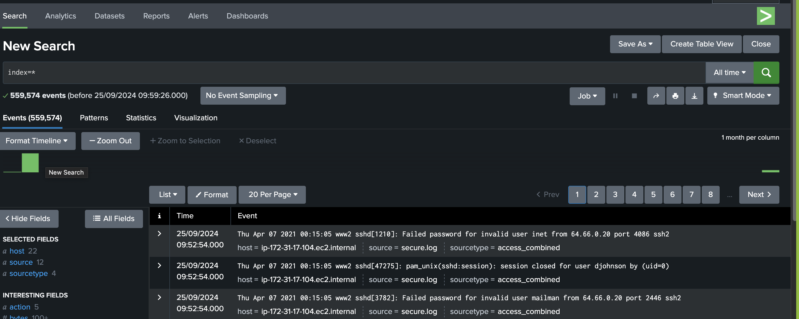

## Splunk Basic 



### more basic info 



## basic Spluk Architecture level 1 



### arch 2 



### arch 22 




### SPE setup 



##  checking splunk LIcense and trails 

[click_here](https://www.splunk.com/en_us/download.html)


## Downloading SPlunk Enterpirse for linux 

```
wget -O splunk-9.3.1-0b8d769cb912.x86_64.rpm "https://download.splunk.com/products/splunk/releases/9.3.1/linux/splunk-9.3.1-0b8d769cb912.x86_64.rpm"


--2024-09-25 05:54:56--  https://download.splunk.com/products/splunk/releases/9.3.1/linux/splunk-9.3.1-0b8d769cb912.x86_64.rpm
Resolving download.splunk.com (download.splunk.com)... 3.167.37.9, 3.167.37.124, 3.167.37.110, ...
Connecting to download.splunk.com (download.splunk.com)|3.167.37.9|:443... connected.
HTTP request sent, awaiting response... 200 OK
Length: 990009597 (944M) [binary/octet-stream]
Saving to: ‘splunk-9.3.1-0b8d769cb912.x86_64.rpm’

splunk-9.3.1-0b8d769cb912.x86_64.rpm   100%[=========================================================================>] 944.15M  76.6MB/s    in 12s     

2024-09-25 05:55:08 (76.6 MB/s) - ‘splunk-9.3.1-0b8d769cb912.x86_64.rpm’ saved [990009597/990009597]


===>>

[ec2-user@ip-172-31-80-225 ~]$ ls
splunk-9.3.1-0b8d769cb912.x86_64.rpm
[ec2-user@ip-172-31-80-225 ~]$ '

```

## Installing Splunk Enterprise license software on RHEL 

```
 sudo rpm -ivh splunk-9.3.1-0b8d769cb912.x86_64.rpm 


warning: splunk-9.3.1-0b8d769cb912.x86_64.rpm: Header V4 RSA/SHA256 Signature, key ID b3cd4420: NOKEY
Verifying...                          ################################# [100%]
Preparing...                          

===> Verify 

rpm -q splunk 

splunk-9.3.1-0b8d769cb912.x86_64
```

### Installation Directory 

```

[ec2-user@ip-172-31-80-225 ~]$ sudo ls /opt/splunk/
LICENSE.txt        bin            etc  include  license-eula.txt  opt                share                                                swidtag
README-splunk.txt  copyright.txt  ftr  lib      openssl           quarantined_files  splunk-9.3.1-0b8d769cb912-linux-2.6-x86_64-manifest
[ec2-user@ip-172-31-80-225 ~]$ 
[ec2-user@ip-172-31-80-225 ~]$ 


===> all SPlunk Binary


 sudo ls /opt/splunk/bin
2to3-3.7                    fill_summary_index.py   mongod                         prichunkpng  pyvenv                          splunk-optimize-lex
2to3-3.9                    genAuditKeys.py         mongod-3.6                     priforgepng  pyvenv-3.7                      splunk-tlsd
ColdStorageArchiver.py      genRootCA.sh            mongod-4.0                     prigreypng   rapidDiag                       splunkd
ColdStorageArchiver_GCP.py  genSignedServerCert.py  mongodump                      pripalpng    recover-metadata                splunkmon
S3benchmark                 genSignedServerCert.sh  mongorestore                   pripamtopng  rest_handler.py                 supervisor-simulator
bloom                       genWebCert.py           noah_self_storage_archiver.py  pripnglsch   runScript.py                    tarit.py
bottle.py                   genWebCert.sh           node                           pripngtopam  safe_restart_cluster_master.py  tocsv.py
btool                       idle3                   openssl                        priweavepng  scripts                         tsidx_scan.py
btprobe                     idle3.7                 parse_xml_buckets.py           pydoc3       scrubber.py                     tsidxprobe
bzip2                       idle3.9                 pcre2-config                   pydoc3.7     searchtest                      tsidxprobe_plo
classify                    importtool              pcregextest                    pydoc3.9     setSplunkEnv                    untarit.py
coldToFrozenExample.py      installit.py            pid_check.sh                   python       shc_upgrade_template.py         walklex
compsup                     jars                    pip                            python3      signtool                        wheel
copyright.txt               jsmin                   pip3                           python3.7    slim
dbmanipulator.py            locktest                pip3.7                         python3.7m   splunk
exporttool                  locktool                pip3.9                         python3.9    splunk-optimize


====>>> all SPlunk config files 

sudo ls /opt/splunk/etc
anonymizer     deployment-apps      log-btool.cfg          log-utility.cfg  myinstall        searchLanguage.xml          splunk.version
apps           disabled-apps        log-cmdline-debug.cfg  log.cfg          openldap         shcluster                   system
auth           findlogs.ini         log-cmdline.cfg        manager-apps     packages         splunk-enttrial.lic         users
copyright.txt  init.d               log-debug.cfg          master-apps      packagetype      splunk-launch.conf
datetime.xml   log-btool-debug.cfg  log-searchprocess.cfg  modules          prettyprint.xsl  splunk-launch.conf.default

```

### start and activate Splunk licensing  (only for the first time)

```
sudo /opt/splunk/bin/splunk --accept-license  start

This appears to be your first time running this version of Splunk.

Splunk software must create an administrator account during startup. Otherwise, you cannot log in.
Create credentials for the administrator account.
Characters do not appear on the screen when you type in credentials.

Please enter an administrator username: admin
Password must contain at least:
   * 8 total printable ASCII character(s).
Please enter a new password: 
```


### checking status 

```
sudo /opt/splunk/bin/splunk  status
splunkd is running (PID: 18311).
splunk helpers are running (PIDs: 18315 18480 18487 18534 18613 18880 19199 19200).
```

### enabling service of splunk persistently 

```
 sudo /opt/splunk/bin/splunk  enable boot-start
Init script installed at /etc/init.d/splunk.
Init script is configured to run at boot.
[ec2-user@ip-172-31-80-225 ~]$ 

```


### Stopping and removing  (uninstalling)


```
 sudo /opt/splunk/bin/splunk  stop 

Stopping splunkd...
Shutting down.  Please wait, as this may take a few minutes.
..                                                         [  OK  ]
Stopping splunk helpers...
                                                           [  OK  ]
Done.

### removing splunk 

sudo rm -rf /opt/splunk/

sudo rpm -e splunk 

```

## SPE licensing 



### COntainer are new resouces where we are running apps 



### Install DOcker in linux 

```
 sudo yum install docker -y
Last metadata expiration check: 2:48:08 ago on Wed Sep 25 04:35:35 2024.
Dependencies resolved.
=========================================================================================================================================================
 Package                                    Architecture               Version                                     Repository                       Size
=========================================================================================================================================================
Installing:
 docker                                     x86_64                     25.0.6-1.amzn2023.0.2                       amazonlinux                      44 M
Installing dependencies:
 containerd                                 x86_64                     1.7.20-1.amzn2023.0.1                       amazonlinux                      35 M
 iptables-libs                              x86_64                     1.8.8-3.amzn2023.0.2                        amazonlinux                     401 k
 iptables-nft                               x86_64                     1.8.8-3.amzn2023.0.2                        amazonlinux                     183 k
 libcgroup                                  x86_64                     3.0-1.amzn2023.0.1                          amazonlinux                      75 k
 libnetfilter_conntrack                     x86_64                     1.0.8-2.amzn2023.0.2                        amazonlinux                      58 k
 libnfnetlink                               x86_64                     1.0.1-19.amzn2023.0.2                       amazonlinux                      30 k
 libnftnl                                   x86_64                     1.2.2-2.amzn2023.0.2                        amazonlinux                      84 k
 pigz                                       x86_64                     2.5-1.amzn2023.0.3            
```

### install and start

```
sudo yum install docker -y
Last metadata expiration check: 2:50:10 ago on Wed Sep 25 04:35:35 2024.
Package docker-25.0.6-1.amzn2023.0.2.x86_64 is already installed.
Dependencies resolved.
Nothing to do.
Complete!
[ec2-user@ip-172-31-80-225 ~]$ 
[ec2-user@ip-172-31-80-225 ~]$ 
[ec2-user@ip-172-31-80-225 ~]$ sudo systemctl  start docker 
```

### creating splunk enterprise server contaienr 

```
sudo  docker run -d -p 8000:8000 -e "SPLUNK_START_ARGS=--accept-license" -e "SPLUNK_PASSWORD=Redhat@12345" --name splunk s
plunk/splunk:latest

```


### checking 

```

sudo docker ps
CONTAINER ID   IMAGE                  COMMAND                  CREATED         STATUS                            PORTS                                                                                              NAMES
69c80e910052   splunk/splunk:latest   "/sbin/entrypoint.sh…"   9 seconds ago   Up 6 seconds (health: starting)   8065/tcp, 8088-8089/tcp, 8191/tcp, 9887/tcp, 0.0.0.0:8000->8000/tcp, :::8000->8000/tcp, 9997/tcp   splunk

```

## Creating and understanding indexing 



## SPL query 




## Deploying sample app server in linux vm 

```
sudo  yum install httpd -y 
 sudo yum install git -y

 ===> taking source code of webapp 

 ---
 git clone https://github.com/schoolofdevops/html-sample-app.git

 -- verify it 

 ec2-user@ip-172-31-17-104 ~]$ ls
html-sample-app

===>>
sudo cp -rf html-sample-app/*  /var/www/html/

===>
sudo systemctl start httpd
```


