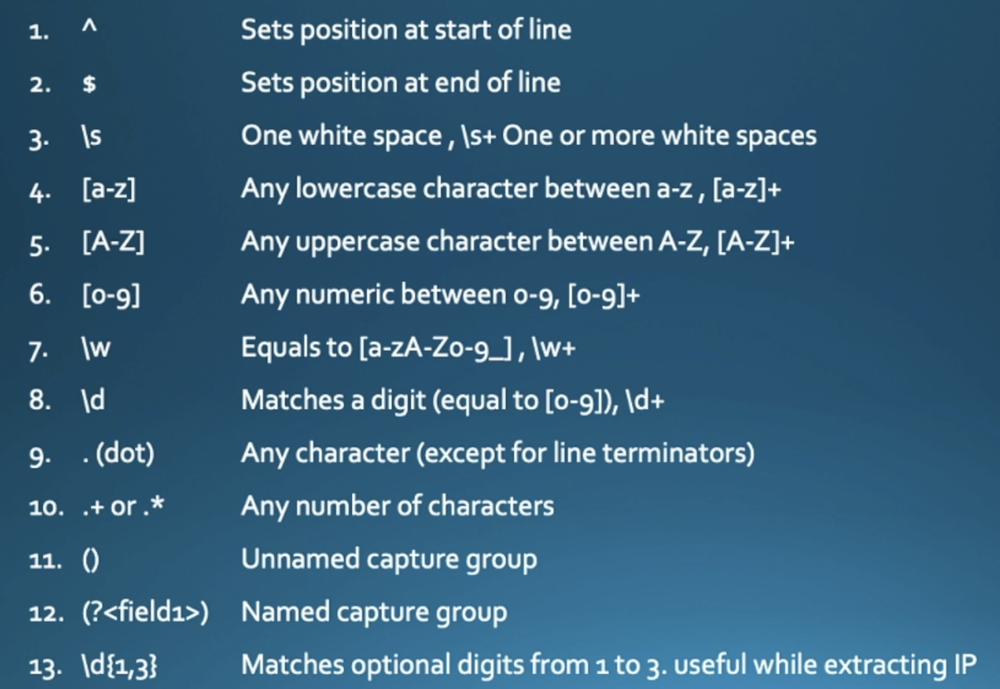

## Revision 


### Rev2 


## Splunk forwarder commands 

```
===> status  check 

sudo /opt/splunkforwarder/bin/splunk status

===> Enterprise server list detail 

sudo /opt/splunkforwarder/bin/splunk   list forward-server

====> list monitor 

 sudo /opt/splunkforwarder/bin/splunk   list  monitor 
```

### starting httpd app to access app 

```
sudo systemctl start httpd
```

### Understanding Splunk Enterprise server -- Indexer 


### How to Interact with search head using SPL 


# SPL 

### Example 1 

```
index="main" host="ip-172-31-80-225.ec2.internal"  ( sourcetype="access_log-too_small" OR sourcetype="access_combined" )
```

### Example 2 

```
index="main"  ( sourcetype="access_log-too_small" OR sourcetype="access_combined" ) | stats count by host | where count > 300 | sort count

```

### Example 3 

```
index="main"  ( sourcetype="access_log-too_small" OR sourcetype="access_combined" ) host="ip-172-31-80-225.ec2.internal" status>=400 status<500 |  stats count by clientip | where count > 2 | sort - count

```

### Example 4 

### using top and rare 

```
index="ashu_web" sourcetype=linux_secure | rare limit=2 process

===>


```


# EvAL 

```
Eval is one of the most powerfull command to do data transformation , manipulation and new field creation as well

```

### Example 5 

```
index="ashu_web" sourcetype=access_combined | eval ashu_urls=mvindex(split(uri,"?"),0) | table uri , ashu_urls
```

### Example 6 

```
index="main" host="ip-172-31-80-225.ec2.internal" | eval  suspicious_clients=if(match(useragent,"(curl|Wget|bots)"), "Suspicious" , "Legitimate" )  |                   table useragent ,suspicious_clients
```

===>

# Example 7 

```
index="main" host="ip-172-31-80-225.ec2.internal" | eval  suspicious_clients=if(match(useragent,"(curl|Wget|bots)"), "Suspicious" , "Legitimate" )  |                   stats count by  suspicious_clients |table suspicious_clients  , count
```

## Regex in SPL 


### keywords and token in SPL regex 




