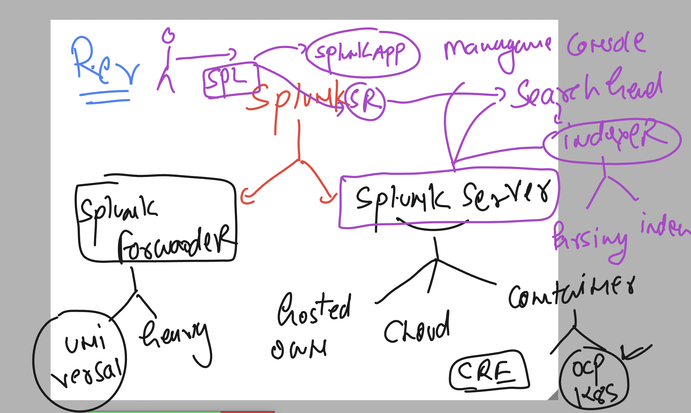
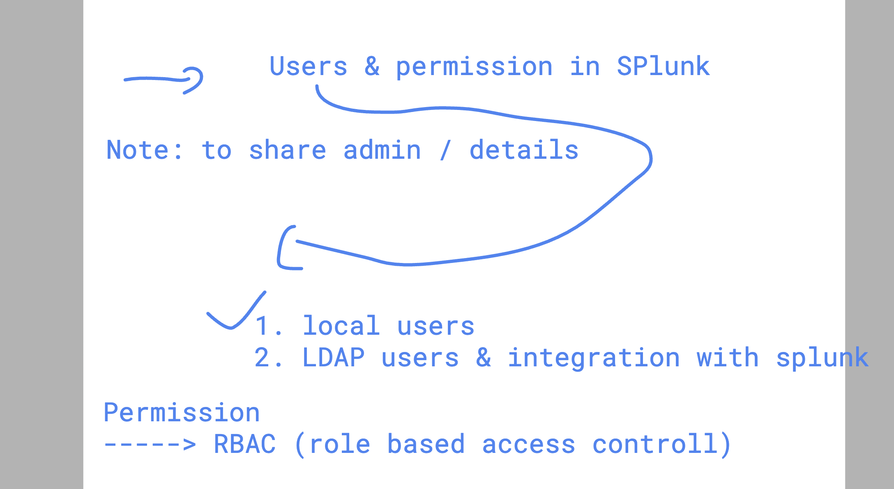
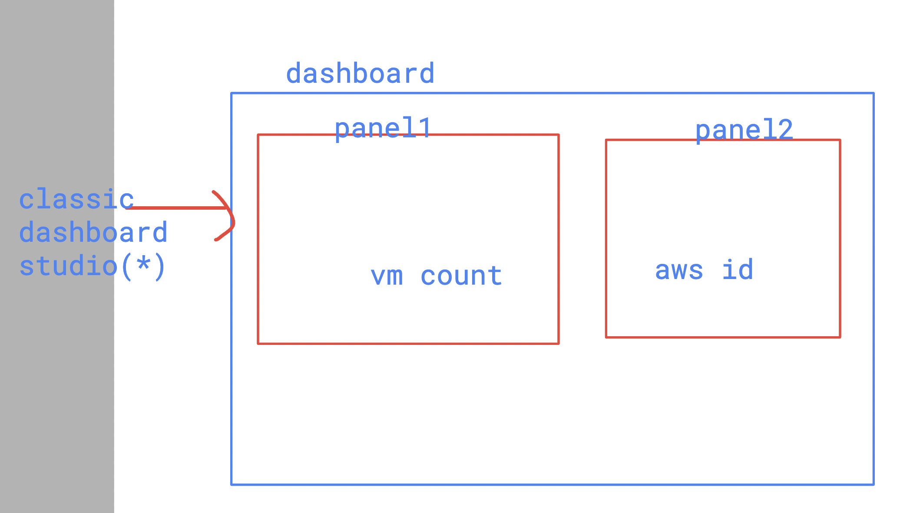

## Revision in Splunk 



## to get Free and Paid Splunk apps 

[click_here](https://splunkbase.splunk.com/)

## to get updated about Splunk you can use Splunk community 

[click_here](https://community.splunk.com/)

## users in Splunk 



### Understanding dashboards 



## Timechart 

```
index="main" host="ip-172-31-80-225.ec2.internal" | timechart count | where count > 100
```


## using Rex command to find patterns and create new field 

```
index="main" host="ip-172-31-80-225.ec2.internal" | rex field=_raw "^(?P<clients_ip>[^ ]+)" | table _time, clients_ip
```

### one more example 

```
index="main" host="ip-172-31-80-225.ec2.internal"  | rex field=_raw "(?<my_keyword>\bhack\b)" | where  mvcount(split(_raw,"hack"))=2 | table _time , my_keyword
```

