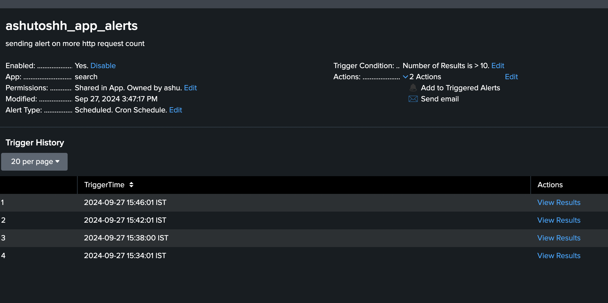
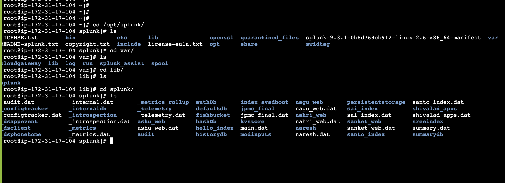
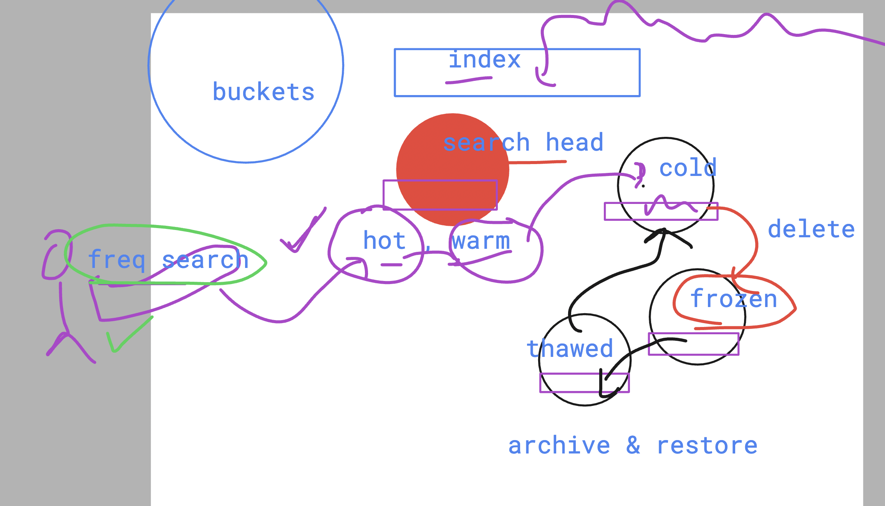
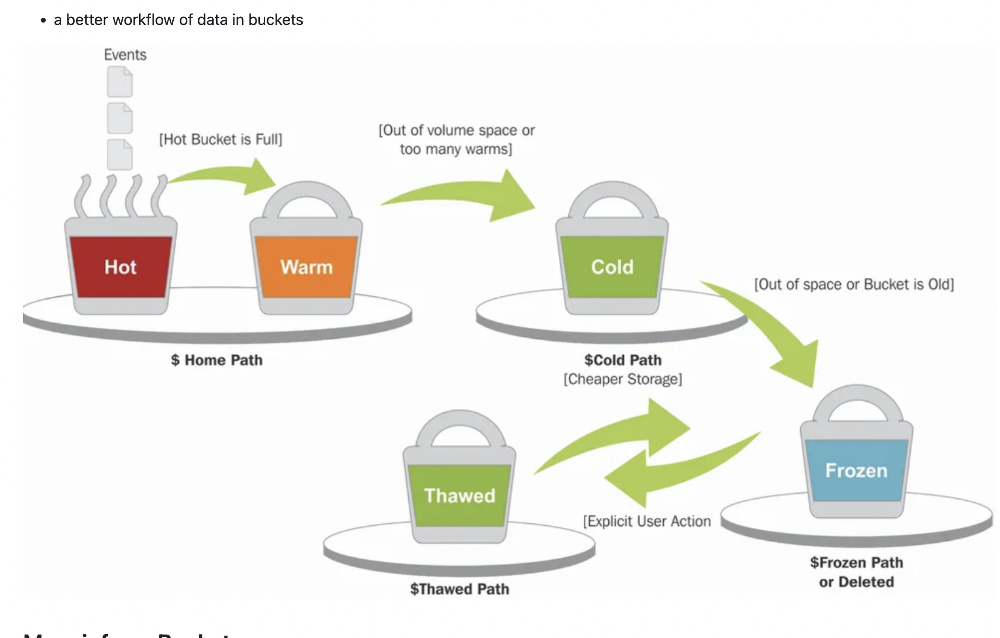
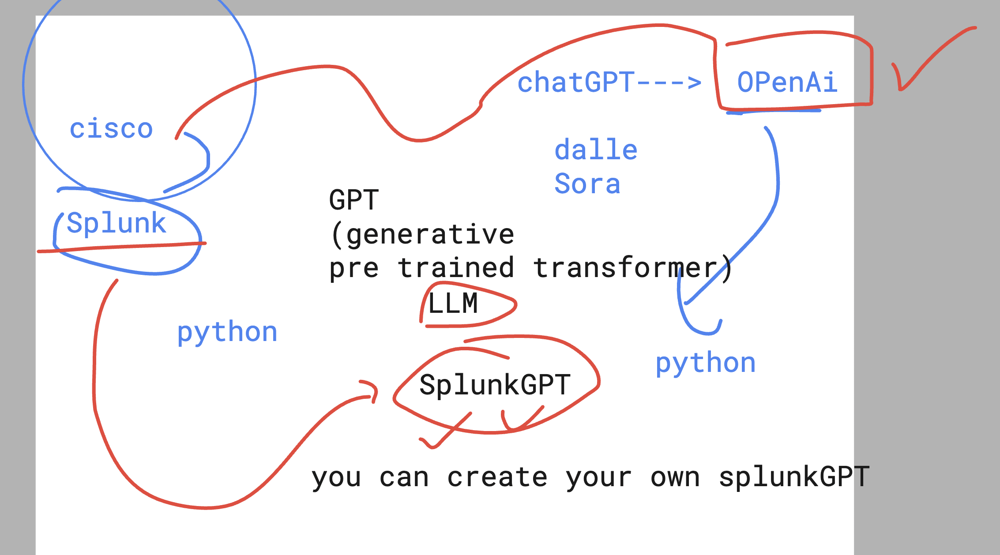
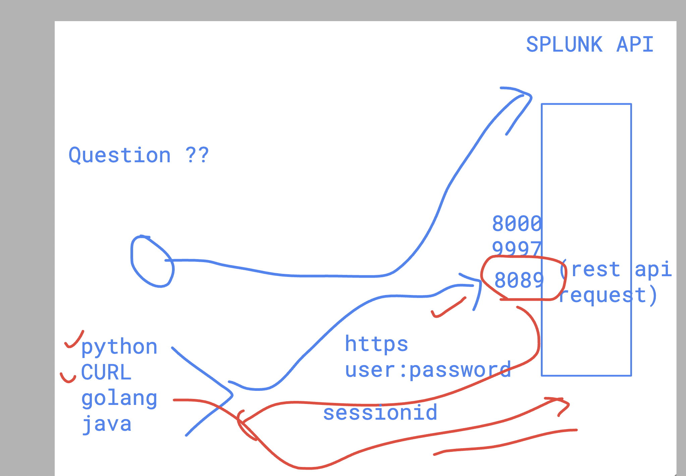

## Revision in Splunk 


## to get Free and Paid Splunk apps 

[click_here](https://splunkbase.splunk.com/)

## to get updated about Splunk you can use Splunk community 

[click_here](https://community.splunk.com/)

## users in Splunk 


### Understanding dashboards 


## Timechart 

```
index="main" host="ip-172-31-80-225.ec2.internal" | timechart count | where count > 100
```


## using Rex command to find patterns and create new field 

```
index="main" host="ip-172-31-80-225.ec2.internal" | rex field=_raw "^(?P<clients_ip>[^ ]+)" | table _time, clients_ip
```

### one more example 

```
index="main" host="ip-172-31-80-225.ec2.internal"  | rex field=_raw "(?<my_keyword>\bhack\b)" | where  mvcount(split(_raw,"hack"))=2 | table _time , my_keyword
```

## configuring SPlunk forwarder to send data to particular index 

```
cat /opt/splunkforwarder/etc/apps/search/local/inputs.conf 
[monitor:///var/log/httpd]
disabled = false


[monitor:///var/log/dnf.log]
index = ashu_web


[monitor:///var/log/nginx]
index = jpmc_final
```

### restart service 

```
/opt/splunkforwarder/bin/splunk restart 
```

## Note: make index must be already available to SPE side 


### SPL 

```
index="main" host="ip-172-31-80-225.ec2.internal" status>=200 status<=310 | bin _time span=10s | stats count as req_count by clientip, _time, | where req_count > 10 | table _time, clientip, req_count
```


## alerts in Splunk 



## Understanding Storage location in Splunk ENterprise 



### Buckets in Index 



### Buckets workflow 



## SplunkGPT 



## SPlunk API 




```
 curl  -u 'admin:Jpmc@12345' -k https://localhost:8089
   16  curl  -u 'admin:Jpmc@12345' -k https://localhost:8089/services
   17  curl  -u 'admin:Jpmc@12345' -k https://localhost:8089/services  | grep -i search 
   18  curl  -u 'admin:Jpmc@12345' -k https://localhost:8089/services/search
   19  curl  -u 'admin:Jpmc@12345' -k https://localhost:8089/services/search/jobs -d search="index=ashu_web"
   20  curl  -u 'admin:Jpmc@12345' -k https://localhost:8089/services/search/jobs -d search="search index=ashu_web"
   21  curl  -u 'admin:Jpmc@12345' -k https://localhost:8089/services/search/jobs/1727437948.10188
   22  history 
```


